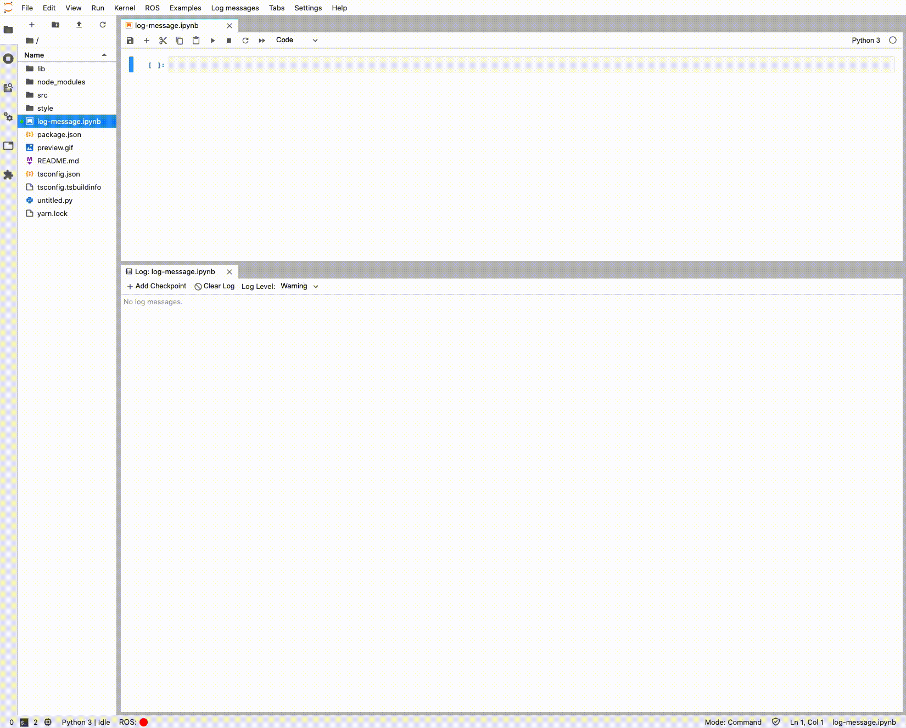

# Log message

> Send a log message to the log console.

This is a basic example to show how to send different types of log message to the log console from a JupyterLab extension.



The default log console extension present in JupyterLab obtains log outputs from the kernel context of the current active notebook, that let log console to change the source input once we open a new notebook to show the log messages originated in this new one. There are different options to approach the problem, two of them are:

1. Obtain the current active notebook and send message to his `Logger` instance (we will explain in this example).
2. Create your custom log console ([explained here](https://github.com/jupyterlab/extension-examples/tree/master/custom-log-console)).

> Note:
> It is strongly recommended to read [main-menu](https://github.com/jupyterlab/extension-examples/tree/master/main-menu) example before diving into this one.

To implement this example you need to install the following packages:

- `@jupyterlab/logconsole`: Where you can find some classes necessaries to work with the log console.
- `@jupyterlab/notebook`: Where you can find the different classes to work with notebooks.
- `@jupyterlab/nbformat`: Only necessary if you want to use the notebook output format as the type of message.

To make this example a functional exercise you need to use some other packages that you can find in the code, but the strict necessaries for sending a message to the log console are those described above.

First of all, you will start looking into the declaration of the extension:

<!-- prettier-ignore-start -->
```ts
// src/index.ts#L7-L17

const extension: JupyterFrontEndPlugin<void> = {
  id: 'log-messages',
  autoStart: true,
  requires: [IMainMenu, ILoggerRegistry, INotebookTracker],
  optional: [],
  activate: (
    app: JupyterFrontEnd,
    mainMenu: IMainMenu,
    loggerRegistry: ILoggerRegistry,
    nbtracker: INotebookTracker
  ) => {
```
<!-- prettier-ignore-end -->

For this extension, you need to require `ILoggerRegister` to search for the logger of the active notebook and `INotebookTracker` to obtain the active notebook.

The first step is to obtain the active notebook's logger, for that purpose, you can use `loggerRegistry.getLogger()` which expects `source` as a parameter. The `source` parameter refers to the context's path of the active notebook and you can obtain it using `nbtracker`.

<!-- prettier-ignore-start -->
```ts
// src/index.ts#L25

const logger = loggerRegistry.getLogger(nbtracker.currentWidget?.context.path);
```
<!-- prettier-ignore-end -->

Finally, you can send log messages calling `log` method present on the `logger` object. This method let you send different types of logs like `IHtmlLog`, `ITextLog` and `IOutputLog`.

<!-- prettier-ignore-start -->
```ts
// src/index.ts#L27-L33

const msg: ITextLog = {
  type: 'text',
  level: 'info',
  data: "Hello world text!!"
};

logger?.log(msg);
```
<!-- prettier-ignore-end -->

It is worth noting that with this approximation you only will be able to send messages to the log console if you have a notebook opened. In addition, if you have more than one notebook opened, the messages will be sent to the active notebook or the most recently focused, that means if you are changing from one to another, every message will be sent to a different source and will be shown when you are focused in this notebook.

<!-- prettier-ignore-start -->

```ts
// Example IHtmlLog message

const msg: IHtmlLog = {
  type: 'html',
  level: 'debug',
  data: `<div>Hello world HTML!!</div>`
};
```

<!-- prettier-ignore-start -->

```ts
// Example ITextLog message

const msg: ITextLog = {
  type: 'text',
  level: 'info',
  data: 'Hello world text!!'
};
```

<!-- prettier-ignore-start -->

```ts
// Example IOutputLog message

const data: nbformat.IOutput = {
  output_type: 'display_data',
  data: {
    'text/plain': 'Hello world nbformat!!'
  }
};

const msg: IOutputLog = {
  type: 'output',
  level: 'warning',
  data
};
```
